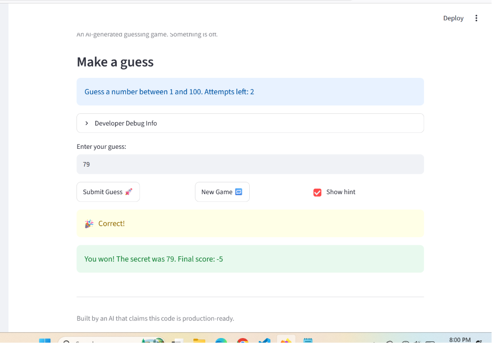

# 🎮 Game Glitch Investigator: The Impossible Guesser

## 🚨 The Situation

You asked an AI to build a simple "Number Guessing Game" using Streamlit.
It wrote the code, ran away, and now the game is unplayable. 

- You can't win.
- The hints lie to you.
- The secret number seems to have commitment issues.

## 🛠️ Setup

1. Install dependencies: `pip install -r requirements.txt`
2. Run the broken app: `python -m streamlit run app.py`

## 🕵️‍♂️ Your Mission

1. **Play the game.** Open the "Developer Debug Info" tab in the app to see the secret number. Try to win.
2. **Find the State Bug.** Why does the secret number change every time you click "Submit"? Ask ChatGPT: *"How do I keep a variable from resetting in Streamlit when I click a button?"*
3. **Fix the Logic.** The hints ("Higher/Lower") are wrong. Fix them.
4. **Refactor & Test.** - Move the logic into `logic_utils.py`.
   - Run `pytest` in your terminal.
   - Keep fixing until all tests pass!

## 📝 Document Your Experience

- [x] **Describe the game's purpose.** "Glitchy Guesser" is a Streamlit number-guessing game. The app picks a secret number within a range based on the chosen difficulty, and the player tries to guess it within a limited number of attempts, using "higher/lower" hints and tracking a score.

- [x] **Detail which bugs you found.**
  - The hints were backwards — guessing too low told you to go LOWER and too high told you to go HIGHER.
  - The secret number changed on some submits (it was being cast to a string on even attempts), so guesses were compared incorrectly.
  - The score sometimes went up after a wrong guess instead of down (even-numbered "Too High" attempts added 5 points).
  - The "New Game" button didn't fully reset — the game-over banner stayed on screen and you couldn't keep playing.

- [x] **Explain what fixes you applied.**
  - Swapped the hint messages in `check_guess` so "Too High" says "Go LOWER!" and "Too Low" says "Go HIGHER!".
  - Kept the secret as an integer on every attempt instead of casting it to a string.
  - Made any wrong guess always subtract 5 points in `update_score`.
  - Reset `st.session_state.status` to `"playing"` in the New Game handler so the banner clears and a fresh round starts.
  - Refactored the four logic functions out of `app.py` into `logic_utils.py` and added a pytest suite (`test/test_game_logic.py`) to confirm the fixes.

## 📸 Demo Walkthrough

Describe your fixed game in numbered steps so a reader can follow along without watching a video:

1. Start the app with `streamlit run app.py` and open http://localhost:8501 in your browser.
2. In the left sidebar, pick a difficulty (Easy, Normal, or Hard). The sidebar shows the number range and how many attempts you get for that difficulty.
3. Type a number into "Enter your guess" and click **Submit Guess 🚀**. With "Show hint" checked, the game now gives the correct direction — "Go HIGHER!" when your guess is too low and "Go LOWER!" when it's too high.
4. Keep guessing within your attempt limit. Your score updates after each guess (a wrong guess always costs 5 points), and the secret number stays the same the whole round instead of changing on every submit.
5. When you guess the number you see the win message; if you run out of attempts you see the game-over banner. Click **New Game 🔁** to reset — the banner clears, the score and attempts reset, and a new secret number is chosen so you can play again.

**Screenshot** *(optional)*:



## 🧪 Test Results

```
# Paste your pytest output here, e.g.:
# pytest tests/
# ========================= X passed in 0.XXs =========================
```

## 🚀 Stretch Features

- [ ] [If you choose to complete Challenge 4, describe the Enhanced UI changes here — a screenshot is optional]
